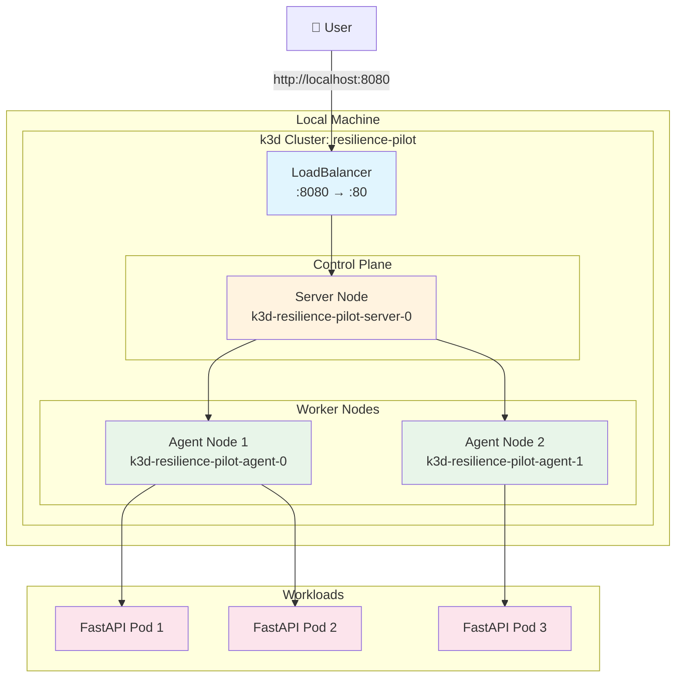
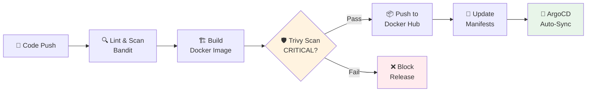

# The Resilience Pilot 🛫

[](https://github.com/AngelP17/k8s-resilience-pilot/actions/workflows/devsecops.yml)

**A production-grade SRE lab demonstrating self-healing Kubernetes, shift-left security, and full observability.**

Built for technical interviews and portfolio demonstrations. 100% local execution using k3d, Docker Desktop, and free tools only.

---

## 🏗️ Architecture



---

## 📊 SRE Metrics & SLOs

| Metric | Target SLO | Description |
|--------|------------|-------------|
| **Availability** | 99.5% | Service responds to health checks |
| **MTTR** | < 30 seconds | Mean Time To Recovery after pod failure |
| **Error Rate** | < 0.5% | HTTP 5xx responses |
| **Latency P95** | < 500ms | 95th percentile response time |

---

## 🚀 Quick Start

### Prerequisites

Ensure you have these tools installed:

```bash
# macOS installation
brew install docker terraform kubectl helm k3d
```

| Tool | Purpose |
|------|---------|
| Docker Desktop | Container runtime |
| Terraform | Infrastructure as Code |
| kubectl | Kubernetes CLI |
| Helm | K8s package manager |
| k3d | Local K8s clusters |

### 3-Command Setup

```bash
# 1. Clone the repository
git clone https://github.com/AngelP17/k8s-resilience-pilot.git
cd k8s-resilience-pilot

# 2. Make scripts executable
chmod +x *.sh

# 3. Run the setup
./setup.sh
```

That's it! The setup script will:
- Provision a 3-node k3d cluster via Terraform
- Build and deploy the FastAPI application
- Install Prometheus & Grafana monitoring
- Configure ArgoCD for GitOps

---

## 🎮 Demo Workflow

### 1. Access the Application

```bash
# Health check
curl http://localhost:8080/health

# View Prometheus metrics
curl http://localhost:8080/metrics
```

### 2. View Monitoring Dashboards

```bash
# Terminal 1: Grafana (admin/admin)
kubectl port-forward svc/prometheus-grafana 3000:80 -n monitoring
# Open: http://localhost:3000

# Terminal 2: Prometheus
kubectl port-forward svc/prometheus-kube-prometheus-prometheus 9090:9090 -n monitoring
# Open: http://localhost:9090
```

### 3. Trigger Chaos & Observe Self-Healing

```bash
# Run the Chaos Monkey
./chaos_monkey.sh
```

Expected output:
```
🐒 CHAOS MONKEY - Kubernetes Self-Healing Demo
═══════════════════════════════════════════════
🎯 Selected victim: resilience-pilot-abc123
💥 Terminating pod...
⏳ Running pods: 2/3 | Elapsed: 5s
⏳ Running pods: 3/3 | Elapsed: 12s

📊 CHAOS EXPERIMENT RESULTS
═══════════════════════════════════════════════
  Victim Pod:        resilience-pilot-abc123
  Recovery Time:     12 seconds
  SLO Target:        < 30 seconds
  
  ✅ SLO MET: MTTR (12s) ≤ Target (30s)
```

### 4. View ArgoCD GitOps

```bash
kubectl port-forward svc/argocd-server 8443:443 -n argocd
# Open: https://localhost:8443
# Get password: kubectl -n argocd get secret argocd-initial-admin-secret -o jsonpath="{.data.password}" | base64 -d
```

---

## 🔄 CI/CD Pipeline



### Pipeline Jobs

1. **Lint & Security Scan**: Bandit static analysis for Python security issues
2. **Build**: Multi-stage Docker build with commit SHA tag
3. **Scan**: Aqua Trivy vulnerability scan (blocks on CRITICAL)
4. **Push**: Conditional push to Docker Hub (only if scan passes)
5. **GitOps**: Auto-commit new image tag → triggers ArgoCD sync

---

## 📁 Project Structure

```
k8s-resilience-pilot/
├── terraform/                  # Infrastructure as Code
│   ├── main.tf                 # k3d cluster definition
│   ├── variables.tf            # Configurable parameters
│   └── outputs.tf              # Cluster info & Mermaid diagram
├── app/                        # FastAPI Application
│   ├── main.py                 # API endpoints
│   ├── requirements.txt        # Python dependencies
│   └── Dockerfile              # Multi-stage, non-root
├── manifests/                  # Kubernetes Resources
│   ├── deployment.yaml         # 3 replicas, probes, anti-affinity
│   ├── service.yaml            # ClusterIP with Prometheus annotations
│   └── ingress.yaml            # Path-based routing
├── monitoring/                 # Observability
│   ├── grafana-dashboard.json  # Pre-built dashboard
│   └── prometheus-rules.yaml   # Alerting rules
├── .github/workflows/
│   └── devsecops.yml          # CI/CD pipeline
├── setup.sh                    # Master setup script
├── setup_monitoring.sh         # Prometheus + Grafana
├── setup_argocd.sh            # GitOps setup
├── chaos_monkey.sh            # Self-healing demo
├── cleanup.sh                 # Teardown
└── test_deployment.sh         # Smoke tests
```

---

## 💡 Skills Demonstrated

### Infrastructure & Automation
- ✅ **Terraform** - Infrastructure as Code for k3d clusters
- ✅ **Kubernetes** - Deployments, Services, Ingress, Resource Management
- ✅ **Helm** - Package management for observability stack
- ✅ **Bash Scripting** - Automation and orchestration

### DevSecOps & CI/CD
- ✅ **GitHub Actions** - Multi-stage CI/CD pipeline
- ✅ **Shift-Left Security** - Bandit (Python) + Trivy (containers)
- ✅ **GitOps** - ArgoCD with auto-sync and self-heal
- ✅ **Container Security** - Multi-stage builds, non-root user

### Observability (The Three Pillars)
- ✅ **Metrics** - Prometheus with custom RED metrics
- ✅ **Visualization** - Grafana dashboards
- ✅ **Alerting** - PrometheusRule CRDs with SLO-based alerts

### Site Reliability Engineering
- ✅ **SLOs/SLIs** - Defined and measured service levels
- ✅ **Self-Healing** - Liveness/Readiness probes
- ✅ **Chaos Engineering** - Controlled failure injection
- ✅ **MTTR Measurement** - Quantified recovery times

### Application Development
- ✅ **Python/FastAPI** - Modern async API framework
- ✅ **Prometheus Client** - Native metrics instrumentation
- ✅ **Docker** - Containerization best practices

---

## 🔧 Configuration

### Environment Variables

| Variable | Default | Description |
|----------|---------|-------------|
| `DEPLOYMENT_NAME` | resilience-pilot | Target deployment for chaos |
| `NAMESPACE` | default | Kubernetes namespace |

### Terraform Variables

| Variable | Default | Description |
|----------|---------|-------------|
| `cluster_name` | resilience-pilot | k3d cluster name |
| `server_count` | 1 | Control plane nodes |
| `agent_count` | 2 | Worker nodes |
| `lb_host_port` | 8080 | LoadBalancer host port |

---

## 🧹 Cleanup

```bash
./cleanup.sh
```

This will:
- Destroy the k3d cluster via Terraform
- Clean up Docker images
- Remove Terraform state

---

## 📚 Further Reading

- [Kubernetes Self-Healing](https://kubernetes.io/docs/concepts/workloads/pods/pod-lifecycle/)
- [SRE Book - Google](https://sre.google/sre-book/table-of-contents/)
- [Prometheus Best Practices](https://prometheus.io/docs/practices/naming/)
- [ArgoCD GitOps](https://argo-cd.readthedocs.io/en/stable/)

---

## 📝 License

MIT License - feel free to use this for your own portfolio!

---

<p align="center">
  Built with ❤️
</p>
# CI/CD trigger
