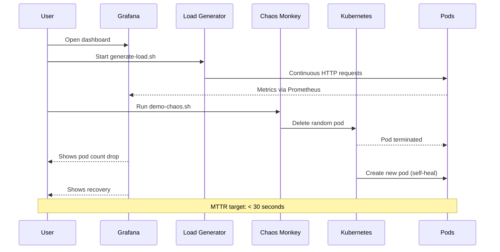

# 🎯 Resilience Pilot - Usage Guide

Complete guide to using your SRE and chaos engineering lab.

## 📋 Table of Contents
1. [Quick Start](#quick-start)
2. [Accessing Services](#accessing-services)
3. [Using Grafana](#using-grafana)
4. [Chaos Engineering](#chaos-engineering)
5. [ArgoCD GitOps](#argocd-gitops)
6. [Troubleshooting](#troubleshooting)

---

## 🔄 Workflow Overview



---

## 🚀 Quick Start

### Start Port Forwards
```bash
# Grafana (Monitoring)
kubectl port-forward -n monitoring svc/prometheus-grafana 3000:80

# Application
kubectl port-forward -n default svc/resilience-pilot 8080:8000

# ArgoCD (Optional)
kubectl port-forward -n argocd svc/argocd-server 8443:443
```

### Generate Load for Metrics
```bash
# Run the load generator in a terminal
./generate-load.sh
```

### Run Chaos Experiment
```bash
# In another terminal
./demo-chaos.sh
```

---

## 🌐 Accessing Services

| Service | URL | Credentials |
|---------|-----|-------------|
| **Application** | http://localhost:8080 | N/A |
| **Grafana** | http://localhost:3000 | admin / admin |
| **ArgoCD** | https://localhost:8443 | admin / (see below) |
| **Prometheus** | Port-forward on 9090 | N/A |

### Get ArgoCD Password
```bash
kubectl -n argocd get secret argocd-initial-admin-secret \
  -o jsonpath="{.data.password}" | base64 -d && echo
```

---

## 📊 Using Grafana

### 1. Login to Grafana
- Open http://localhost:3000
- Username: `admin`
- Password: `admin`
- Skip password change (or change if you prefer)

### 2. Find Your Dashboard
1. Click the hamburger menu (☰) on the left
2. Navigate to **Dashboards**
3. Click on **Resilience Pilot Dashboard**

### 3. Understanding the Panels

#### Request Rate
Shows HTTP requests per second. You need to generate load to see data:
```bash
./generate-load.sh
```

#### Error Rate
Displays the percentage of failed requests. Normally should be 0%.

#### Response Time (Latency)
- **P50**: 50% of requests are faster than this
- **P95**: 95% of requests are faster than this
- **P99**: 99% of requests are faster than this

#### Pod Status
Shows number of running pods. Should be 3 normally.
Watch this during chaos experiments!

#### Chaos Events
Records when pods are killed by the chaos monkey or manually deleted.

### 4. Time Range
- Top right corner: Select time range
- For live testing: Use **Last 5 minutes** with auto-refresh
- Click the refresh icon to set auto-refresh (e.g., every 5s)

### 5. Variables
Some dashboards have variables at the top:
- **Pod**: Select specific pod to view
- **Namespace**: Filter by namespace (default: default)

---

## 🔥 Chaos Engineering

### Understanding Resilience
The app has 3 replicas with:
- **Health probes**: K8s kills unhealthy pods
- **Readiness probes**: K8s stops sending traffic to starting pods
- **Anti-affinity**: Spreads pods across different nodes

### Experiment 1: Manual Pod Deletion
```bash
# Kill a random pod
kubectl delete pod -l app=resilience-pilot --grace-period=0 --force

# Watch recovery
watch kubectl get pods -l app=resilience-pilot
```

**Expected Result**:
- Pod is killed
- New pod starts within ~2 seconds
- Pod becomes ready in ~8 seconds
- No user-facing downtime (other 2 pods still serving)

### Experiment 2: Automated Chaos Demo
```bash
./demo-chaos.sh
```

This script:
1. Shows current pod status
2. Starts background load generation
3. Kills a random pod
4. Monitors recovery for 30 seconds
5. Shows final status

**Watch in Grafana**:
- Open Grafana dashboard before running
- Set time range to "Last 5 minutes" with 5s auto-refresh
- Run the script
- Observe:
  - Pod count drops from 3 to 2, then back to 3
  - Brief spike in response time (if any)
  - No increase in error rate (the 2 healthy pods handle traffic)

### Experiment 3: Sustained Load During Chaos
```bash
# Terminal 1: Generate continuous load
./generate-load.sh

# Terminal 2: Delete pods repeatedly
for i in {1..5}; do
  echo "Chaos round $i"
  kubectl delete pod -l app=resilience-pilot --grace-period=0 --force
  sleep 15
done
```

**Watch**:
- Grafana dashboard showing metrics during chaos
- Request rate stays constant
- Error rate should remain low (< 1%)
- Response time may spike briefly

### Measuring MTTR (Mean Time To Recovery)
```bash
# Time how long until pod is ready
time (kubectl delete pod -l app=resilience-pilot --grace-period=0 --force && \
      kubectl wait --for=condition=ready pod -l app=resilience-pilot --timeout=60s)
```

**Target**: Recovery in < 10 seconds

---

## 🔄 ArgoCD GitOps

### Access ArgoCD
```bash
# Start port-forward
kubectl port-forward -n argocd svc/argocd-server 8443:443

# Get password
kubectl -n argocd get secret argocd-initial-admin-secret \
  -o jsonpath="{.data.password}" | base64 -d && echo

# Open browser
open https://localhost:8443
```

### What You'll See
- **Application**: resilience-pilot
- **Status**: Healthy and Synced
- **Auto-Sync**: Enabled (watches Git repo)
- **Self-Heal**: Enabled (auto-corrects drift)

### Testing GitOps
When CI/CD pushes a new image:
1. GitHub Actions updates `manifests/deployment.yaml`
2. Commits to Git with new image SHA
3. ArgoCD detects the change within ~3 minutes
4. ArgoCD triggers rolling update
5. Pods are replaced one-by-one (zero downtime)

### Manual Sync
If you make manual changes to manifests:
```bash
# Trigger sync immediately
kubectl -n argocd patch app resilience-pilot \
  --type merge -p '{"metadata":{"annotations":{"argocd.argoproj.io/refresh":"true"}}}'
```

---

## 🐛 Troubleshooting

### Grafana Shows No Data

**Problem**: Empty graphs in Grafana

**Solutions**:
1. Generate load:
   ```bash
   ./generate-load.sh
   ```

2. Check Prometheus is scraping:
   ```bash
   kubectl port-forward -n monitoring svc/prometheus-kube-prometheus-prometheus 9090:9090
   # Open http://localhost:9090
   # Go to Status → Targets
   # Find "resilience-pilot" - should be UP
   ```

3. Verify ServiceMonitor:
   ```bash
   kubectl get servicemonitor resilience-pilot -o yaml
   ```

### Port Forward Keeps Dying

**Problem**: `port-forward` stops working

**Solutions**:
1. Check if process is running:
   ```bash
   ps aux | grep port-forward
   ```

2. Restart it:
   ```bash
   # Kill old ones
   pkill -f "port-forward.*grafana"

   # Start new one
   kubectl port-forward -n monitoring svc/prometheus-grafana 3000:80
   ```

3. Use a background script:
   ```bash
   nohup kubectl port-forward -n monitoring svc/prometheus-grafana 3000:80 &
   ```

### Application Not Responding

**Problem**: Can't reach http://localhost:8080

**Check pods**:
```bash
kubectl get pods -l app=resilience-pilot
kubectl logs -l app=resilience-pilot --tail=50
```

**Check service**:
```bash
kubectl get svc resilience-pilot
kubectl describe svc resilience-pilot
```

**Restart port-forward**:
```bash
kubectl port-forward svc/resilience-pilot 8080:8000
```

### Chaos Experiments Show No Impact

**Problem**: Deleting pods doesn't show in metrics

**Why**: You need **active load** to see the impact:
```bash
# Generate load BEFORE running chaos
./generate-load.sh &

# Then run chaos
./demo-chaos.sh
```

### CI/CD Pipeline Failing

**Check recent runs**:
```bash
# If you have gh CLI
gh run list --limit 5

# View specific run
gh run view <run-id>
```

**Common issues**:
- Missing Docker Hub secrets
- Trivy found CRITICAL vulnerabilities
- GitOps update permission issues

### ArgoCD Out of Sync

**Problem**: ArgoCD shows "OutOfSync"

**Fix**:
```bash
# Manual sync
kubectl -n argocd patch app resilience-pilot \
  --type merge -p '{"operation":{"initiatedBy":{"username":"admin"},"sync":{"revision":"HEAD"}}}'

# Or use ArgoCD CLI
argocd app sync resilience-pilot
```

---

## 📈 Best Practices for Demo

### Preparing for a Demo

1. **Start Everything**:
   ```bash
   # Terminal 1: Grafana
   kubectl port-forward -n monitoring svc/prometheus-grafana 3000:80

   # Terminal 2: Application
   kubectl port-forward svc/resilience-pilot 8080:8000

   # Terminal 3: Load generator
   ./generate-load.sh
   ```

2. **Open Browser Tabs**:
   - Grafana: http://localhost:3000
   - Application: http://localhost:8080/health
   - GitHub Actions: https://github.com/YourUsername/k8s-resilience-pilot/actions

3. **Set Grafana Time Range**:
   - Last 5 minutes
   - Auto-refresh: 5 seconds

4. **Wait 2-3 minutes** for metrics to populate

### During Demo

1. **Show Application Health**:
   - Open http://localhost:8080/health
   - Point out 3 healthy pods

2. **Show Metrics**:
   - Open Grafana dashboard
   - Explain each panel

3. **Run Chaos Experiment**:
   - Run `./demo-chaos.sh`
   - Watch Grafana dashboard
   - Show how quickly it recovers

4. **Show GitOps**:
   - Show recent GitHub Actions run
   - Show ArgoCD UI
   - Explain auto-sync

---

## 🎓 Learning Objectives Demonstrated

✅ **Site Reliability Engineering**
- Multi-replica deployments for high availability
- Health and readiness probes
- Anti-affinity for fault tolerance
- Observability with Prometheus + Grafana

✅ **Chaos Engineering**
- Controlled failure injection
- MTTR measurement
- Resilience testing
- No single point of failure

✅ **DevSecOps**
- Security scanning (Bandit, Trivy)
- Security gates in CI/CD
- Shift-left security

✅ **GitOps**
- Declarative infrastructure
- Git as single source of truth
- Automated deployments
- Self-healing applications

✅ **Observability**
- RED metrics (Rate, Errors, Duration)
- Custom Grafana dashboards
- Prometheus scraping
- Alert rules (optional)

---

## 🔗 Useful Commands

```bash
# View all resources
kubectl get all -n default
kubectl get all -n monitoring
kubectl get all -n argocd

# Check logs
kubectl logs -l app=resilience-pilot -f --tail=100

# Describe resources
kubectl describe deployment resilience-pilot
kubectl describe svc resilience-pilot

# Port forwards (all in one)
kubectl port-forward -n monitoring svc/prometheus-grafana 3000:80 &
kubectl port-forward svc/resilience-pilot 8080:8000 &

# Clean up port forwards
pkill -f port-forward

# Force pod restart (chaos)
kubectl rollout restart deployment resilience-pilot

# Scale replicas
kubectl scale deployment resilience-pilot --replicas=5

# Watch pod status (live updates)
watch -n 1 kubectl get pods -l app=resilience-pilot
```

---

## 📚 Additional Resources

- [Prometheus Docs](https://prometheus.io/docs/)
- [Grafana Dashboards](https://grafana.com/grafana/dashboards/)
- [ArgoCD Docs](https://argo-cd.readthedocs.io/)
- [Chaos Engineering Principles](https://principlesofchaos.org/)
- [SRE Book](https://sre.google/books/)

---

**Need Help?** Check the main [README.md](README.md) or open an issue on GitHub.
