# Terraform k3d Infrastructure

This directory contains Terraform configuration for provisioning a local k3d Kubernetes cluster.

## Requirements

| Tool | Version | Installation |
|------|---------|-------------|
| Terraform | >= 1.0.0 | `brew install terraform` |
| Docker | Latest | [Docker Desktop](https://docker.com) |
| k3d | >= 5.0 | `brew install k3d` |

## Quick Start

```bash
# Initialize Terraform
terraform init

# Preview changes
terraform plan

# Create cluster
terraform apply -auto-approve

# Verify cluster
kubectl get nodes
```

## Configuration

| Variable | Default | Description |
|----------|---------|-------------|
| `cluster_name` | resilience-pilot | Name of the k3d cluster |
| `server_count` | 1 | Control plane nodes |
| `agent_count` | 2 | Worker nodes |
| `lb_host_port` | 8080 | Host port for LoadBalancer |

## Architecture

```mermaid
graph TB
    subgraph "k3d Cluster"
        subgraph "Control Plane"
            S[Server Node<br/>k3d-resilience-pilot-server-0]
        end
        
        subgraph "Worker Nodes"
            A1[Agent Node 1<br/>k3d-resilience-pilot-agent-0]
            A2[Agent Node 2<br/>k3d-resilience-pilot-agent-1]
        end
        
        S --> A1
        S --> A2
    end
    
    LB[LoadBalancer<br/>:8080 → :80] --> S
    
    style S fill:#fff3e0
    style A1 fill:#e8f5e9
    style A2 fill:#e8f5e9
    style LB fill:#e1f5fe
```



> [!TIP]
> Run `terraform output architecture_diagram` after deployment for a dynamic version.

## Cleanup

```bash
terraform destroy -auto-approve
```
